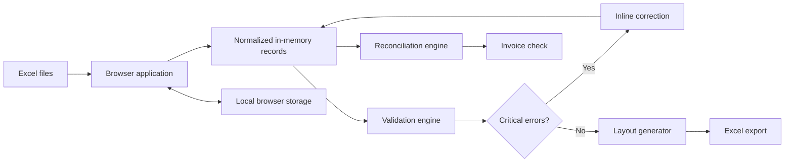

# Life Insurance Billing Platform

> A browser-based workflow for corporate group-life billing, designed to replace fragile spreadsheet macros with validation-led, repeatable operations.

## Overview

Life Insurance Billing Platform is a portfolio case study of a standalone web application for the monthly billing cycle of group life insurance. The original workflow relied on an Excel macro and manual cross-checking. The platform brings import, data quality checks, insurer-layout generation, reconciliation, and monthly control into one browser-based experience.

The design principle is intentionally simple: **open in a modern browser, work locally, and export safely**. No application server or installation is required for the operational workflow.

## The challenge

The legacy process introduced recurring operational risk:

- Repetitive manual completion of billing fields.
- Errors detected too late in the process.
- Manual reconciliation across client, import, and insurer data.
- Spreadsheet macros that were difficult to distribute and maintain.
- Loss of leading zeros when national ID values were interpreted as numbers by Excel.

## The solution

The platform turns the billing cycle into a guided six-step workflow:

1. Import and review insured-member data.
2. Apply safe bulk completion and inline edits.
3. Validate critical business rules in real time.
4. Generate an insurer-specific export only when critical errors are resolved.
5. Reconcile up to three data sources and invoice totals.
6. Compare the current cycle with the latest archived cycle.
7. Register the cycle in a monthly checklist.

## Product capabilities

| Capability | Outcome |
| --- | --- |
| Data normalization | Restores leading zeros in identifier values and keeps them as text in exports. |
| Real-time validation | Highlights invalid, incomplete, and duplicate records before delivery. |
| Configurable business rules | Supports company-level capital, premium, duplicate-enrollment, and sub-invoice rules. |
| Bulk completion | Applies shared cycle values without repetitive row-by-row work. |
| Insurer-layout export | Produces the expected column structure and blocks export on critical errors. |
| Three-way reconciliation | Compares insurer, imported, and client sources; flags changes and field-level differences. |
| Invoice check | Compares member count, insured capital, and premium totals with a tolerance rule. |
| Historical comparison | Audits the current cycle against the latest archived cycle and highlights registration, salary, insured-capital, and premium changes. |
| Local continuity | Uses browser storage for automatic state recovery during an active cycle. |
| Monthly checklist | Records completion by company and reporting month. |

## Impact

The pilot reduced a typical processing cycle from approximately **30 minutes to under 5 minutes** — an estimated **85% reduction** — while moving validation earlier in the process and reducing rework caused by corrupted identifiers or incorrect billing values.

## Architecture

Read the [architecture overview](docs/architecture.md) for the component model and design decisions.

## Screenshots

The interface is intentionally kept in Portuguese, reflecting the workflow of its intended operational users. The portfolio documentation is in English for broader accessibility.

| Data workspace | Validation dashboard |
| --- | --- |
|  |  |

| Insurer layout preview | Three-way reconciliation |
| --- | --- |
|  |  |

| Company settings | Monthly checklist |
| --- | --- |
|  |  |

> Screenshots use fictional organizations and sanitized data. Do not add production files, personal data, commercial values, or company branding to this public repository.

## Documentation

- [Architecture](docs/architecture.md)
- [Business rules](docs/business-rules.md)
- [Process flow](docs/process-flow.md)
- [Roadmap](docs/roadmap.md)

## GitHub Pages

This repository includes a static presentation site at the repository root. In GitHub, open **Settings → Pages**, select **Deploy from a branch**, then choose `main` and `/(root)`.

`https://<your-github-username>.github.io/life-insurance-billing-platform/`

## Portfolio scope

This is a public portfolio representation of a real operational modernization initiative. It intentionally excludes the original application source, production configurations, client identities, insurer-specific commercial rules, credentials, and operational data. Names, figures, and examples must remain fictional or generalized.

## Author

**Pamela Soares**  
Operational Excellence · Process Automation · AI-assisted product delivery

## License

This portfolio repository is available under the [MIT License](LICENSE).
