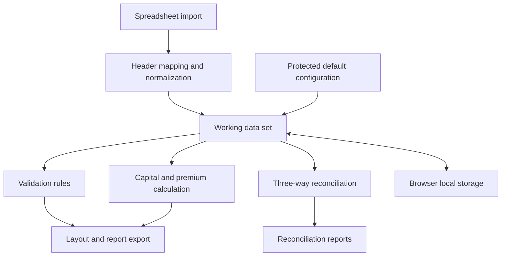

# Architecture

## Purpose

The operational application was designed as a portable, browser-first tool for a recurring billing process. Its architecture prioritizes low adoption friction: users can open a single web file locally instead of installing software or relying on a server environment.

## Logical components

## Implementation model

| Layer | Responsibility |
| --- | --- |
| Interface | Six workflow tabs for data, validation, layout, reconciliation, company configuration, and checklist. |
| Domain logic | Functions for identifier normalization, validation, calculation, layout creation, and comparison. |
| Working state | In-memory records for the selected company and billing cycle. |
| Persistence | Browser `localStorage` for recovery of an active local session. |
| Spreadsheet I/O | Client-side reading and writing of workbook data through SheetJS/XLSX. |

## Key design decisions

### Single-file, browser-first delivery

The original workflow favored portability over a conventional client-server stack. A standalone HTML application avoids deployment, installation, and macro enablement while remaining easy to distribute internally.

### Local processing

Billing files are processed in the browser. This reduces infrastructure needs and avoids sending operational data to an application API for the use case represented here.

### Protected default configuration

Default company settings are retained in application code and merged with editable saved settings. This provides a recoverable baseline instead of relying only on browser storage.

### Quality gate at export

Users can inspect and fix records freely, but the final insurer-layout export remains unavailable while a critical validation issue exists. This places the quality control at the handoff point without blocking work-in-progress.

## Constraints and future evolution

The architecture is suitable for local cycles with hundreds of records. A multi-user, high-volume, or audited production version would benefit from authenticated access, a database, role-based controls, server-side processing, and automated tests.
