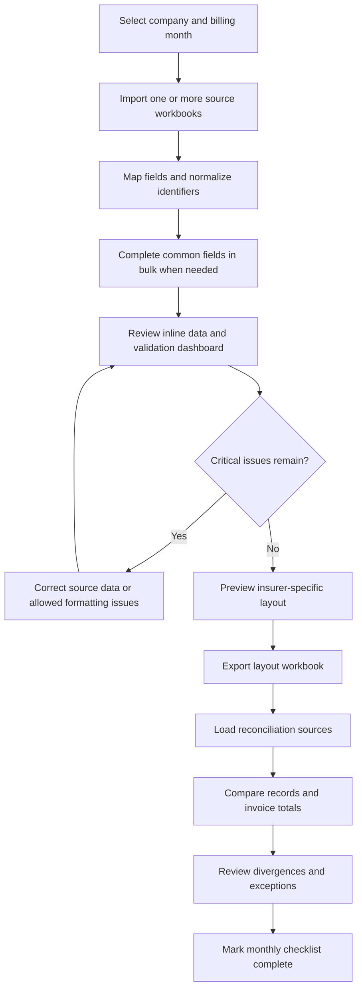

# Process Flow

## Monthly operational flow

## Workflow modules

| Module | User objective | Main output |
| --- | --- | --- |
| Data | Import and maintain the monthly insured-member list. | Normalized, editable working data. |
| Validation | Identify issues before delivery. | Record- and field-level issue list. |
| Layout | Create the required workbook. | Validated spreadsheet export. |
| Reconciliation | Verify source consistency and invoice totals. | Summary and discrepancy reports. |
| Companies | Maintain reusable operational parameters. | Calculation and exception settings. |
| Checklist | Track closure by billing month. | Completion log for the cycle. |

## Control principles

1. Normalize identifiers at every entry and comparison point.
2. Keep automatic corrections limited to safe formatting fixes.
3. Preserve evidence: flag data instead of silently deleting records.
4. Validate before export, not only after a file has been sent.
5. Keep defaults recoverable and company exceptions explicit.
